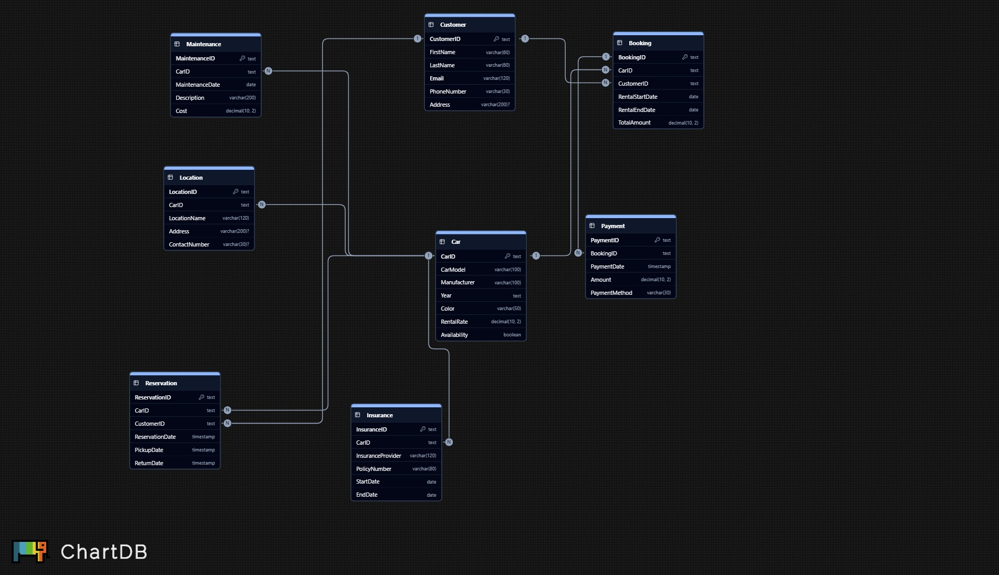

# Todo ERD

## ---

# Car Rental Management System

This project presents an *ER Diagram* and *SQL Server script* for a Car Rental Management System.
It includes complete database objects, data integrity rules, and sample CRUD queries.

*Entities:*
Car │ Customer │ Booking │ Payment │ Insurance │ Location │ Reservation │ Maintenance

*Highlights:*

* Primary / Foreign key relationships for all entities
* CHECK and UNIQUE constraints
* ≥ 5 records per table
* Example SELECT, UPDATE and DELETE queries

*How to run:*

1. Open *SQL Server Management Studio*.
2. Create a new database and execute ERD_Car_Rental.sql.
3. Use SELECT * FROM Car; to verify data.

*Files included:*

* ERD_Car_Rental.sql – DDL + seed + queries
* readme-assets/erd.png – ChartDB ER Diagram